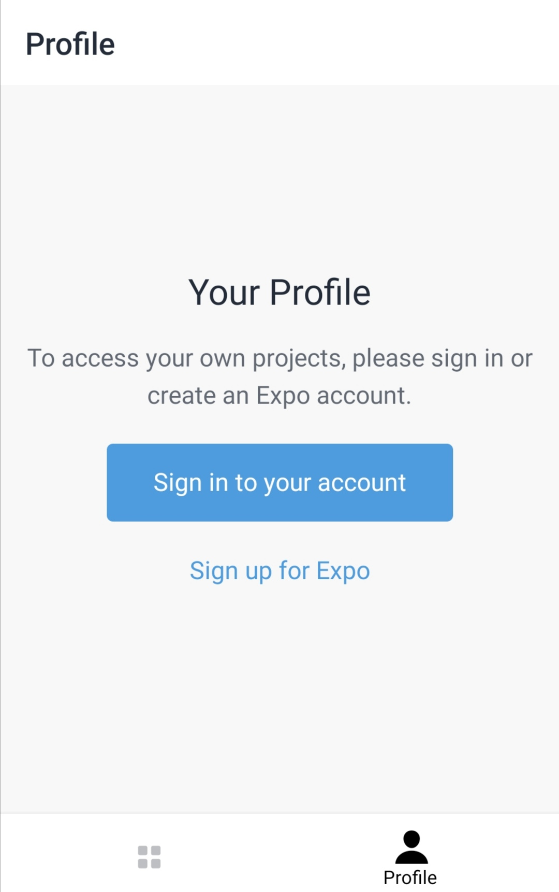
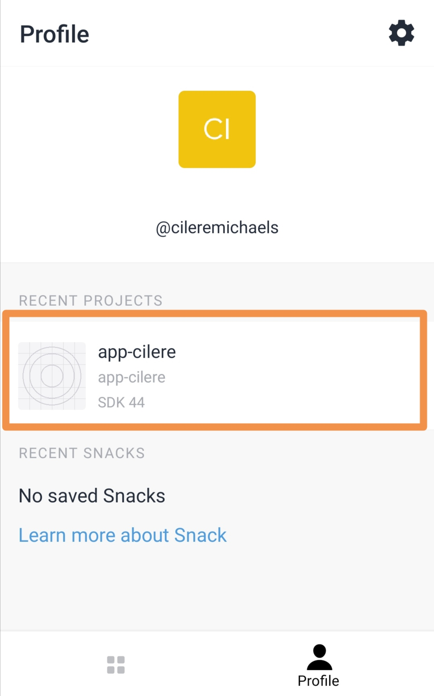
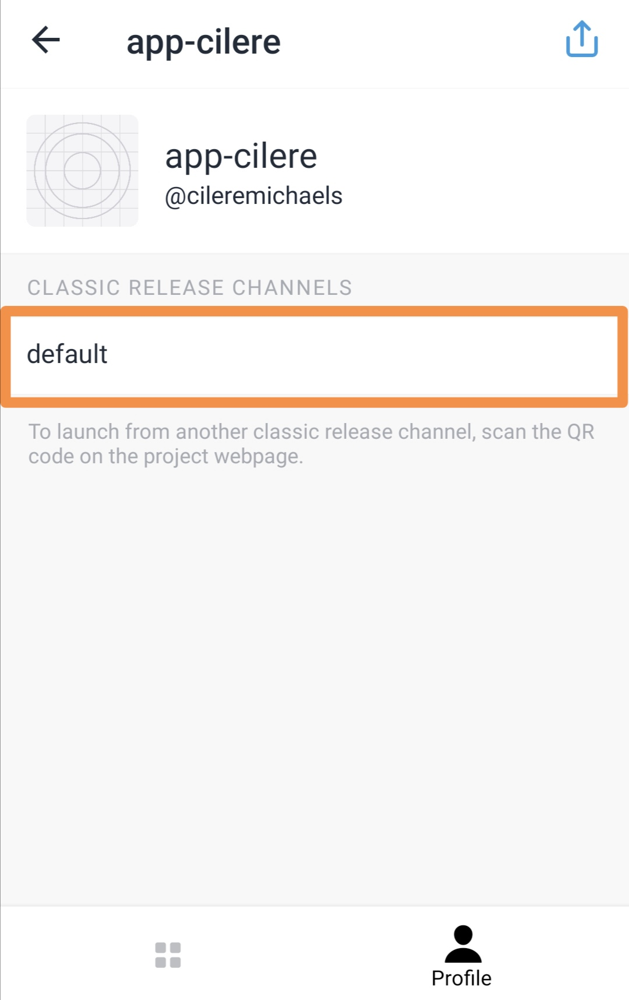
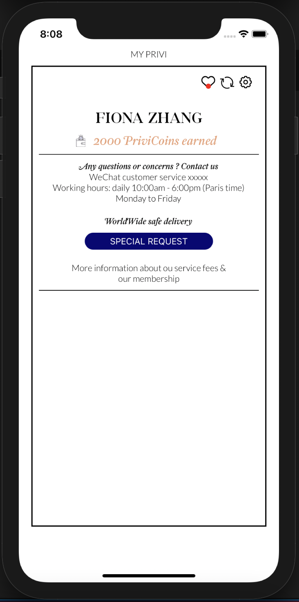

<h1>Etape de lancement du projet (sur iOS)</h1>
- Installer l'application <strong>Expo Go</strong> depuis l'App store dans votre téléphone

- Lancez l'app Expo go puis connectez-vous (<em>Sign in to your account</em>) avec les identifiants :

username : cileremichaels 
password : cilere12345
 

- Une fois connecté selectionner <strong>app-cilere</strong>

- Selectionner ensuite <strong>default</strong>

- Vous arriverez enfin sur la page du projet.

